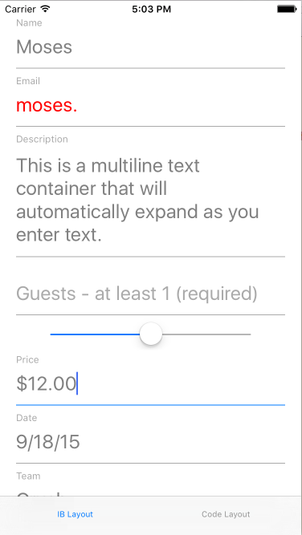
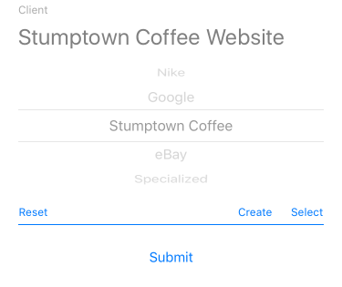

## InstrumentUtils_iOS ##

Utils are in Swift 2.0, and can be used from Objective-C.

EasyFormInput
-------


A handsome iOS text input component that can handle:

 - single- or multi-line text entry
 - validated email entry
 - numerical entry with decimal & currency options
 - date selection
 - dropdown list selection, with type-in options for search or creating new entries


The component shows the input title in the main textfield as a prompt with a line below it. When tapped into the title, the line transitions color and the title transitions to a small title above the entered or picked text.

You can configure:

 - Fonts and text colors
 - Date and number formats
 - Line color, and color during editing
 - Padding around the component and main text

The component works in a UIScrollView (and most likely in a UITableView as well, although I haven't tested that). The selected field will scroll into view when the keyboard shows.

To use in a scroll view, set up a blank container view that has constraints on it including a nominal height (perhaps 50 points) and constraints that bind it above and below. As long as everything in scroll view is bound from the superview top to bottom and each item includes a height, the scroll view will be able to calculate its content size automatically and will operate correctly. (Note that your container view's height constraint will be replaced at runtime so it can change its height dynamically, so don't expect a fixed height, and don't add any referencing outlet on the container's height constraint.)

As long as constraints are in place you should be able to set up a config containing your settings, optionally set a delegate, call a single constructor, and then check the component's `value` property to retrieve the input value.

``` Swift
if let validEmail = emailInput.value as? String { }

if let date = dateInput.value as? NSDate { }

if let teamSelection = teamInput.value as? [String:String] { }
else if let newTeamName = teamInput.value as? String { }
```

See component documentation for more details.


BlockingProgressIndicator
-------
A simple blocking spinnner view with the option to show a text string. Font and text color are configurable prior to use.


ConstraintsHelpers
-------
Shortcut methods for working with auto-layout constraints.

``` Swift
extension UIView

// Retrieval
func getConstraintsForOtherView:
func getConstraintForOtherView:withAttribute:

// Removal
func removeAllConstraints:
func removeConstraintsForOtherView:

// Generation
func addConstraintsWithVisualFormat:views:
func addConstraintsWithVisualFormats:views:
func addConstraintForSubview:withVisualFormat:
func addSizeMatchingConstraintsForSubview:
func addSizeMatchingConstraintsForSubview:withMargins:
func addCenteringConstraintsForSubview:
func addSimpleConstraintForAttribute:constant:
func addConstraintForSubview:attribute:toTargetViewAttribute:constant:
func addEqualConstraintForSubview:attribute:
func addEqualConstraintsForSubview:attributes:
func addEqualConstraintForSubview:subviewAttribute attribute:toTargetViewAttribute:
func addEqualConstraintForSubview:otherSubview:attribute:
func addEqualConstraintsForSubview:otherSubview:attributes:
func addEqualConstraintForSubview:attribute:otherSubview:otherAttribute:

// Scroll View Constraints Helpers
createScrollableContainerViewInScrollView:margins:
createScrollableContainerView:
addStackingConstraintsForSubview:subview:topItem:top:edgeMargins:bottomItem:bottom:height:
```
    

TwoLineNavBarTitle
-------
Shows two lines of text in your UINavigationController's top bar. Font and text color are configurable prior to use.

Display modes include:

 - Large title with smaller subtitle below it

``` Swift
class func updateNavBarTitleFor(viewController:UIViewController, title:String, subtitle:String)
```

 - Single title that word-wraps to two lines for long titles

``` Swift
class func updateNavBarTitleFor(viewController:UIViewController, title:String)
```
Installation
------------

```ruby
pod 'InstrumentUtils_iOS'
```

