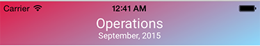
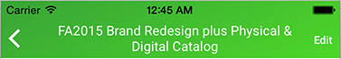

## InstrumentUtils_iOS ##

Utils are in Swift 2.0, and can be used from Objective-C.

EasyFormInput
-------


A handsome iOS text input component that can handle:

 - single- or multi-line text entry
 - validated email entry
 - numerical entry with decimal & currency options
 - date selection
 - dropdown list selection, with type-in options for search or creating new entries


The component shows the input title in the main textfield as a prompt with a line below it.

When the user taps on the form, the underline changes color and the title becomes a small heading.

You can configure:

 - Fonts and text colors
 - Date and number formats
 - Line color, and color during editing
 - Padding around the component and main text

The component works in a UIScrollView (and most likely in a UITableView as well, although I haven't tested that). A sample project is included which describes how to set up the necessary Auto Layout constraints, using an IB layout or code only. Once set up correctly, components will fluidly resize within the scroll view, and the selected form will scroll into view when the keyboard shows.

Setting up constraints requires a small amount of effort to get right, but using the form component is really simple. You just create a config, create the component, and check its value.

A single config can be handily reused since it's a struct:

``` Swift
var config = EasyFormInputConfig()
config.textFont = UIFont(name: "Roboto-Medium", size:12.0)!
config.textColor = UIColor.blackColor()
```
Next, instantiate the component:

``` Swift
self.emailInput = EasyFormInput(parentView: container1, type: .Email, title: "Email", required:true, configuration: config)
```

(The last two parameters in the above example are optional. Other optional parameters include `initialValue` and `selectValues`.)

Now just check its `value`. The return type of `Any` can be casted using `if let` to the expected type:

``` Swift
// .Email
if !emailInput.valueIsValid() {
	emailInput.becomeFirstResponder()
	return
}
if let email = emailInput.value as? String {…}

// .Date
if let date = dateInput.value as? NSDate {…}

// .Select
if let teamData = teamInput.value as? [String:String] {…}

// .Select + config.typeInSelectAllowsUnique
if let clientSelection = clientInput.value as? [String:String] {
	// existing item was picked
}
else if let newClientName = clientInput.value as? String {
	// user typed in a unique entry
}
```

The returned `value` will be `nil` if the form is in an unset state. The `valueIsValid()` method shown above is pretty basic, it will return `false` on a bad email or a required field that was left blank. 

For more advance usage you may set a `delegate` on the component to respond to text changes. You can also peek at the form's `rawText` value and check whether `stateIsEmptyOrDefault()` if you need to.

See the sample project for more details.


BlockingProgressIndicator
-------
A simple blocking spinnner view with the option to show a text string. Font and text color are configurable prior to use.


ConstraintsHelpers
-------
Shortcut methods for working with auto-layout constraints.

``` Swift
extension UIView

// Retrieval
func getSimpleConstraintWithAttribute:
func getConstraintsForOtherView:
func getConstraintForOtherView:withAttribute:

// Removal
func removeAllConstraints:
func removeConstraintsForOtherView:

// Generation
func addConstraintsWithVisualFormat:views:
func addConstraintsWithVisualFormats:views:
func addConstraintForSubview:withVisualFormat:
func addSizeMatchingConstraintsForSubview:
func addSizeMatchingConstraintsForSubview:withMargins:
func addCenteringConstraintsForSubview:
func addSimpleConstraintForAttribute:constant:
func addConstraintForSubview:attribute:toTargetViewAttribute:constant:
func addEqualConstraintForSubview:attribute:
func addEqualConstraintsForSubview:attributes:
func addEqualConstraintForSubview:subviewAttribute attribute:toTargetViewAttribute:
func addEqualConstraintForSubview:otherSubview:attribute:
func addEqualConstraintsForSubview:otherSubview:attributes:
func addEqualConstraintForSubview:attribute:otherSubview:otherAttribute:

// Scroll View Constraints Helpers
func createScrollableContainerViewInScrollView:margins:
func createScrollableContainerView:
func addStackingConstraintsForSubview:subview:topItem:top:edgeMargins:bottomItem:bottom:height:
```

example:

``` Swift
view.addSizeMatchingConstraintsForSubview(scrimView)
view.addCenteringConstraintsForSubview(spinner)
view.addEqualConstraintForSubview(label, attribute: .CenterX)
view.addEqualConstraintForSubview(label, attribute: .CenterY).constant = 40.0
```

TwoLineNavBarTitle
-------
Shows two lines of text in your UINavigationController's top bar. Font and text color are configurable prior to use.

``` Swift
// In your view controller:

// Title with smaller subtitle below it
TwoLineNavBarTitle.updateNavBarTitleFor(self, title: titleString,
	 subtitle: subtitleString)

// Title that auto-shrinks & word-wraps to 2 lines
TwoLineNavBarTitle.updateNavBarTitleFor(self, title: titleString)
```





Installation
------------

```ruby
pod 'InstrumentUtils_iOS'
```

